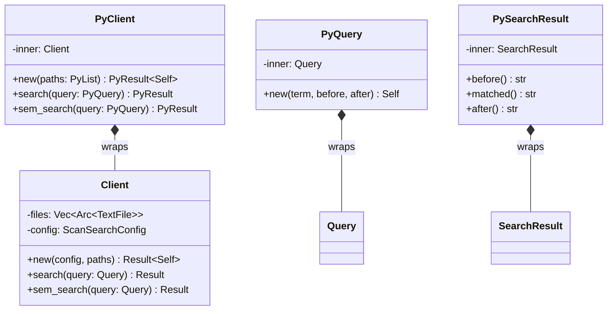
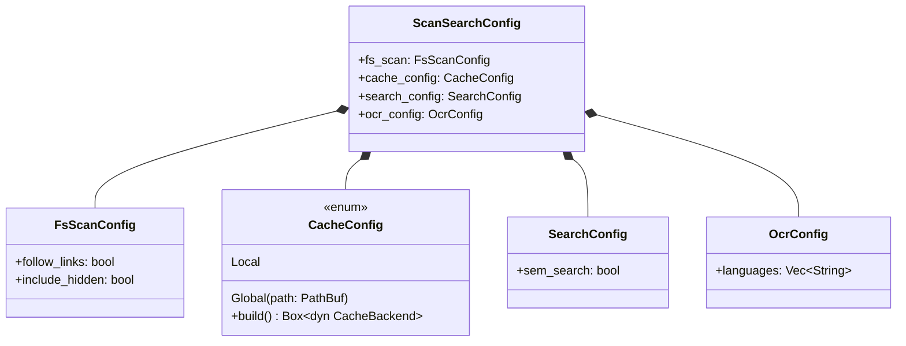
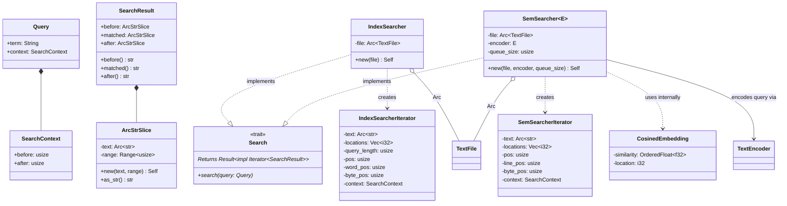
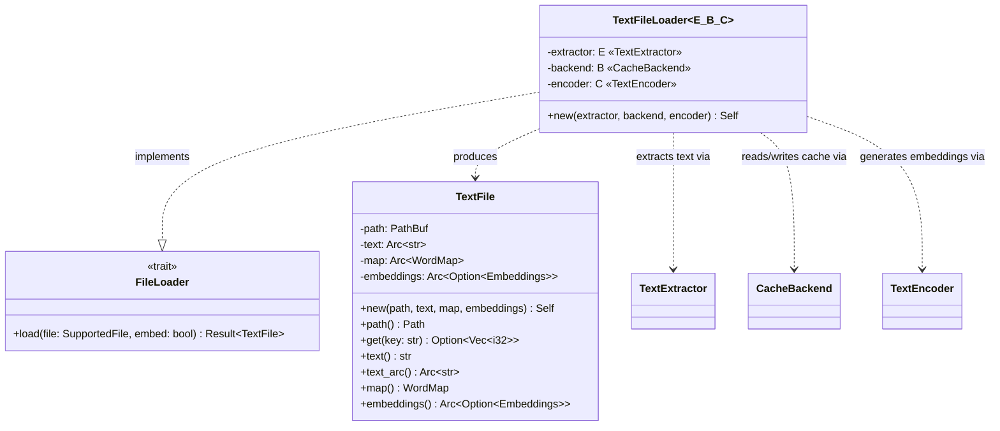
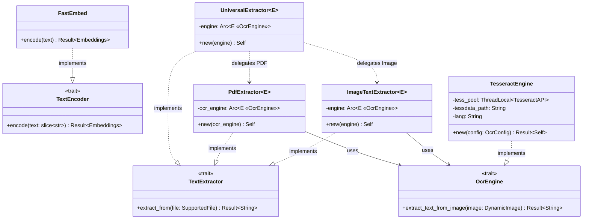
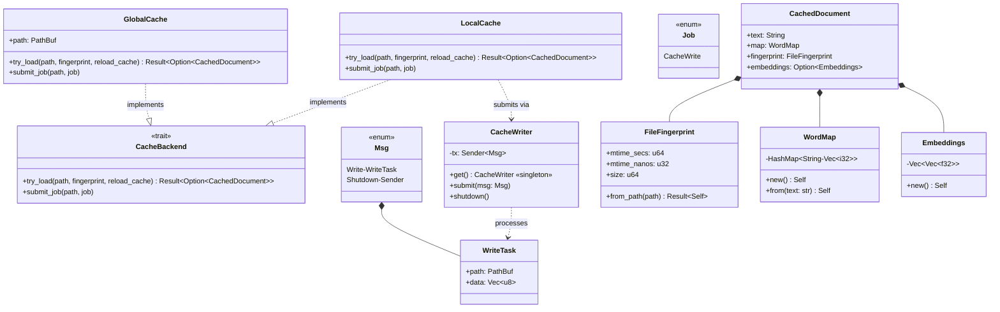
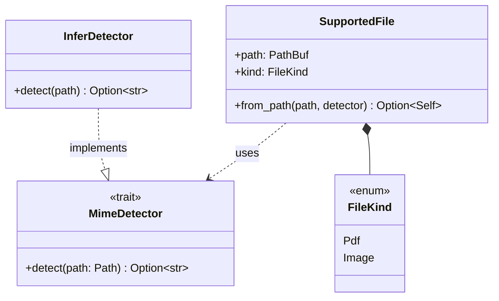
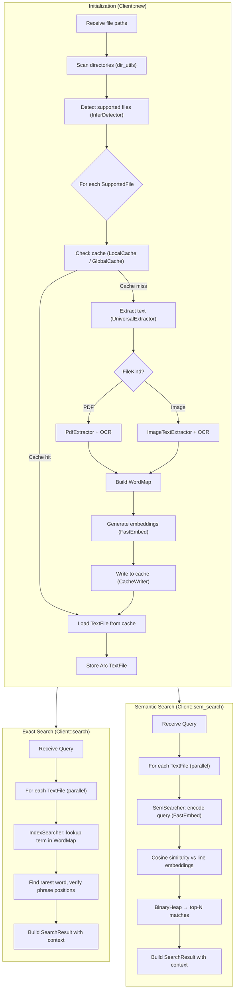

# zpr-scan-search — Architecture UML

---

## 1 · Python Bindings & Orchestration

---

## 2 · Configuration

---

## 3 · Search Core & Implementations

---

## 4 · File & Loader

---

## 5 · Extractor, Encoder & OCR

---

## 6 · Caching Subsystem

---

## 7 · File Detection

---

## Search Flow

